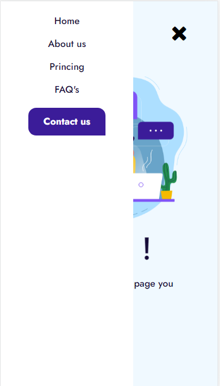

  <h1 align="left">Simple 404 not found</h1>

This is a simple page 404 not found

  <a href="" rel="noopener">
  
Desktop

 </a>

Mobile

 </a>

Mobile Menu

 </a>

---

## About

Displays a simple 404 not found demo. Designed with HTML5, CSS, Flexbox and Media queries.

## Usage

You can use it for pages that do not exist in the website.
